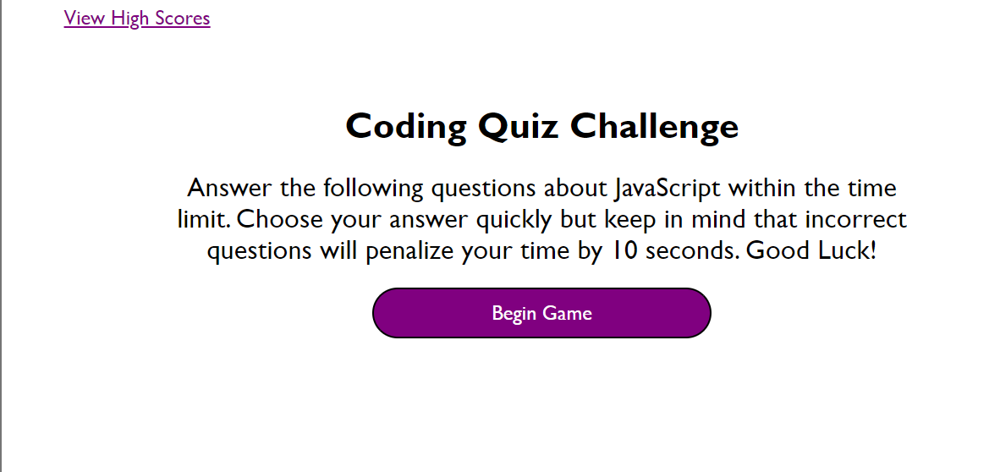
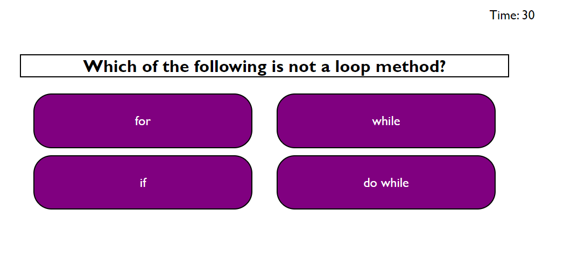

# coding-quiz

## Description
Here I made a quiz showing how HTML, CSS, and JavaScript can work together. I made multiple screens that hide and display based on what event listeners that you click. After you finish the quiz a high score will be saved on your local storage

## Installation
N/A

## Usage
Anybody can use this program to challenge themselves to a little JavaScript trivia challenge.

## Credits 
None

## License
Please refer to the LICENSE in the repo.

Website can be found at:
https://prkrgreenwell.github.io/coding-quiz/